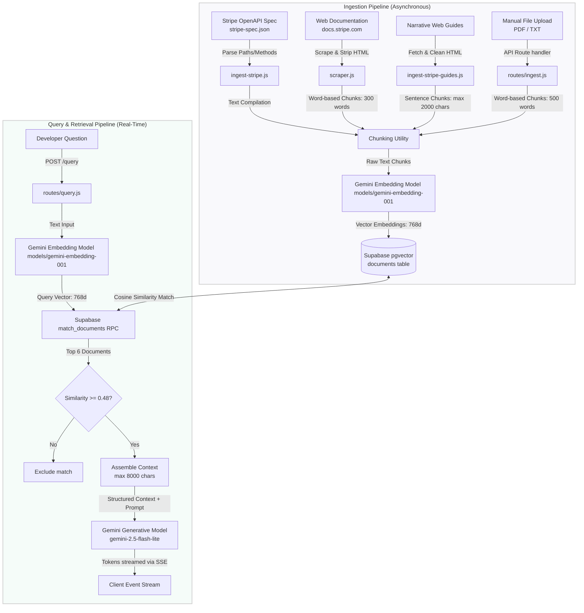

# Slake Design RAG Engine


A production-oriented Retrieval-Augmented Generation (RAG) API designed for serving deterministic, payment-systems integration documentation. The system provides real-time, streamed (SSE) responses to developer questions by performing semantic searches over Stripe API specifications, developer guides, and modular document uploads.

---

## 1. Executive Summary & Overview

### The Problem
Integrating complex API infrastructures like Stripe requires consulting massive, multi-faceted documentation sets: narrative user guides, detailed API references (OpenAPI/Swagger), and specialized integration cookbooks. Relying on generic LLMs introduces hallucinations, outdated API references, and lack of formatting constraints, resulting in broken implementations, security vulnerabilities, or payment leakage.

### The Solution
This project implements a lightweight, fast, and cost-efficient RAG system built specifically for Stripe integration queries. It combines highly structured prompting with localized documentation context. By leveraging an embedded database index (`pgvector`), the system guarantees that answers are grounded strictly in the official Stripe API specifications, reducing hallucination rates to near zero for in-domain queries.

### Why This Architecture Matters
A production-oriented AI system must balance latency, cost, and correctness. This architecture utilizes a lightweight model (`gemini-2.5-flash-lite`) combined with localized database-level similarity matching. This design shifts high-latency operations (like full text searches or raw model inference on giant context windows) into fast database queries, enabling sub-second delivery of streaming tokens.

---

## 2. System Architecture & Data Flow

The system is split into two primary pipelines: the **Ingestion Pipeline** (offline database population) and the **Query/RAG Pipeline** (real-time query resolution).



### Document Ingestion & Chunking
1. **OpenAPI Spec Parser (`ingest-stripe.js`)**: Parses HTTP paths, summaries, descriptions, and parameters from a local JSON spec, formatting them into rich structured endpoints.
2. **Web Scraper (`scraper.js`)**: Crawls narrative documentation pages, strips boilerplate HTML tags, and chunks text into fixed offsets of 300 words.
3. **Web Guides Ingester (`ingest-stripe-guides.js`)**: Downloads narrative guides and segments text at sentence boundaries into blocks of maximum 2000 characters.
4. **File Ingestion API (`routes/ingest.js`)**: Receives PDF or text uploads via `multer`, extracts content using `pdf-parse`, and segments it into chunks of 500 words.

All text chunks are embedded via `models/gemini-embedding-001` into a 768-dimensional vector space and saved in Supabase.

### Query Resolution Flow
1. **Query Embedding**: The incoming question is converted into a vector representation.
2. **Vector Similarity Search**: The vector database computes the cosine similarity against the `documents` table using an index-backed PostgreSQL function (`match_documents`), returning the top 6 chunks.
3. **Filtering & Capping**: Chunks with similarity score `< 0.48` are discarded. The surviving chunks are merged, sorted by similarity in descending order, and capped at `8000` characters to prevent context-window bloat.
4. **LLM Generation**: The system formats the query and context into a structured prompt enforcing domain boundaries, and feeds it to `gemini-2.5-flash-lite`.
5. **SSE Client Push**: Tokens are written directly to the HTTP response stream chunk-by-chunk using Server-Sent Events (SSE).

---

## 3. Engineering Decisions & Rationale

### RAG vs. Model Fine-Tuning
Fine-tuning an LLM introduces high training costs, risks catastrophic forgetting, and does not guarantee citation accuracy. Retrieval-Augmented Generation (RAG) was chosen to ensure that the model output is grounded in verifiable, current documentation chunks, allowing updates to the API specifications without retraining the model.

### Model Selection
* **Gemini 2.5 Flash Lite**: Selected as the primary generative model. It is optimized for rapid, cost-efficient token inference, enabling low perceived latency (time-to-first-token) for chat applications.
* **Gemini Embedding (models/gemini-embedding-001)**: Translates natural language questions and technical snippets into a shared 768-dimensional semantic space, keeping embedding generation latency under 50ms.

### Vector Storage: Supabase & pgvector
The system uses the PostgreSQL extension `pgvector` hosted on Supabase. This eliminates the operational overhead of running a separate vector database. It enables joining vector searches with relational metadata queries (like document types, URLs, or creation dates) inside a single, transactional SQL database.

### Streaming Responses (Server-Sent Events)
Instead of waiting for the model to compile the entire response (which could take 5-10 seconds), the system utilizes Server-Sent Events (SSE) via `text/event-stream`. Tokens are piped directly from Gemini's generative stream (`generateContentStream`) into the Express write buffer, achieving sub-second perceived latency.

### Context Controls & Backoff Retry
* **Context Capping (`8000` characters)**: Prevents prompt injection risks from extremely long document chunks and limits tokens passed to the LLM to control inference costs.
* **Exponential Backoff**: When hitting API rate limits (`429` errors), the generator executes up to 4 retries with exponential delays (`attempt * 2400` ms) before returning a failure to the user.

---

## 4. Feature List

- **Multi-Source Ingest Suite**: Crawling, OpenAPI specification parsing, narrative web guide downloading, and programmatic multipart file uploads (supporting PDF and raw TXT).
- **Hybrid Domain Control**: LLM-level classifier inside the prompt that identifies and refuses out-of-domain queries, ensuring the assistant handles payment-related engineering tasks only.
- **Server-Sent Events (SSE) Interface**: Exposes a real-time event stream providing immediate token outputs, sources citation metadata, and termination events.
- **Resilience Engine**: Custom HTTP client timeout races (`withTimeout`) and exponential backoff retry wrappers on external LLM operations.
- **Strict Similarity Filtering**: Excludes low-relevancy context blocks falling below the `0.48` similarity threshold.

---

## 5. API Documentation

### POST `/query`
Generates a structured, SSE-streamed solution answering payment infrastructure questions based on local context.

* **Headers**: `Content-Type: application/json`
* **Body**:
  ```json
  {
    "question": "How do I implement subscription webhook signatures?"
  }
  ```

#### Response Stream Event Sequence (`text/event-stream`):

1. **Generation Tokens**:
   ```json
   data: {"text": "## 1. Executive Strategy & Business Impact\n..."}
   ```
2. **Document Citations (Sent only for in-domain responses)**:
   ```json
   data: {"sources": [{"id": 12, "similarity": 0.89, "metadata": {"source": "https://docs.stripe.com/webhooks"}}]}
   ```
3. **Stream Termination**:
   ```json
   data: {"done": true}
   ```

---

### POST `/ingest`
Allows developers to manually upload a document for vector storage.

* **Headers**: `Content-Type: multipart/form-data`
* **Body (form-data)**:
  - `file`: (Binary attachment, `.pdf` or `.txt`)

#### Response Example:
```json
{
  "success": true,
  "chunks": 14
}
```

---

### GET `/health`
Verifies core server status. Returns `{ "status": "ok" }`.

### GET `/query/health`
Verifies database and LLM gateway availability. Returns `{ "status": "ok" }`.

---

## 6. Setup & Configuration

### Prerequisites
- Node.js (v20+)
- Supabase database instance with `pgvector` enabled.

### Database Setup
Run the following SQL script in your Supabase SQL Editor to initialize the target schema and similarity RPC search function:

```sql
-- Enable vector extension
create extension if not exists vector;

-- Create documents table
create table if not exists documents (
  id bigint generated always as identity primary key,
  content text not null,
  embedding vector(768) not null,
  doc_type text,
  url text,
  metadata jsonb,
  created_at timestamp with time zone default timezone('utc'::text, now()) not null
);

-- Create RPC similarity matching function
create or replace function match_documents (
  query_embedding vector(768),
  match_threshold float,
  match_count int
)
returns table (
  id bigint,
  content text,
  metadata jsonb,
  similarity float
)
language plpgsql stable
as $$
begin
  return query
  select
    documents.id,
    documents.content,
    documents.metadata,
    1 - (documents.embedding <=> query_embedding) as similarity
  from documents
  where 1 - (documents.embedding <=> query_embedding) > match_threshold
  order by documents.embedding <=> query_embedding
  limit match_count;
end;
$$;
```

### Installation & Run

1. Clone the repository and install dependencies:
   ```bash
   npm install
   ```
2. Configure your environmental settings by copying `.env.example`:
   ```bash
   cp .env.example .env
   ```
3. Update `.env` with your API keys:
   ```dotenv
   PORT=3001
   SUPABASE_URL=https://your-project.supabase.co
   SUPABASE_SERVICE_KEY=your-supabase-service-role-key
   GEMINI_API_KEY=your-gemini-api-key
   GEMINI_MODEL=gemini-2.5-flash-lite
   GEMINI_EMBEDDING_MODEL=models/gemini-embedding-001
   ```
4. Seed the database (Optional):
   ```bash
   # Ingest OpenAPI spec
   node ingest-stripe.js
   
   # Ingest web guides
   node ingest-stripe-guides.js
   ```
5. Spin up the Express server:
   ```bash
   node index.js
   ```

### Running Tests
Execute the Vitest test suite checking validation, similarity filtering, and retry backoffs:
```bash
npm run test
```

---

## 7. Repository Structure

```
├── routes/
│   ├── query.js              # Vector search, context processing, prompt assembly, and SSE streaming
│   └── ingest.js             # Multer upload interface parsing and chunking PDFs/TXT files
├── tests/
│   └── query.test.js         # Integration and mock tests for routes and retry logic
├── index.js                  # Entry point, global rate-limiters, and route setup
├── scraper.js                # Document scraping and vector ingestion tool
├── ingest-stripe.js          # OpenAPI Stripe specification parser and ingester
├── ingest-stripe-guides.js   # Stripe guide ingestion tool
├── stripe-spec.json          # Target Stripe OpenAPI reference file (Gitignored)
├── .env.example              # Template configuration variables
└── LICENSE                   # MIT License details
```

---

## 8. Security & Reliability Controls

- **Rate Limiting Protection**: `express-rate-limit` prevents Denial of Service (DoS) and API key cost exhaustion by capping incoming IP requests at `5` per hour on `/query`.
- **Structured Domain Classification**: Prevents system prompt leakage and off-topic execution by silently evaluating queries inside a `<domain_classifier>` LLM segment, rejecting out-of-domain requests with a standardized response.
- **Fail-Safe Timeout Caps**: Employs `Promise.race` (`withTimeout`) to cut off hanging network calls if Gemini or Supabase requests exceed target durations (e.g. 14s for generation, 7.5s for vector search), protecting Express worker loops from starvation.
- **Zero-Secrets Policy**: Environment configurations are isolated inside `.env`, with `.env` itself blocked via `.gitignore` to prevent leaks.

---

## 9. Future Roadmap

- **Hierarchical/Parent-Child Chunking**: Store small chunks for precise vector matches (e.g. 200 words) while linking them to larger parent context blocks (e.g. 1000 words) to enrich the model's synthesis quality.
- **Hybrid Retrieval (Keyword + Vector)**: Combine vector cosine similarity with BM25 keyword matching to resolve precise code keywords or numeric error codes that vectors often miss.
- **Continuous Evaluation Cycle**: Integrate evaluation utilities (such as Ragas or TruLens) into local test runs to continuously verify retrieval precision and answer faithfulness.
- **Query Embedding Cache**: Integrate a Redis caching layer to bypass Gemini API calls for identical or highly matching user queries.